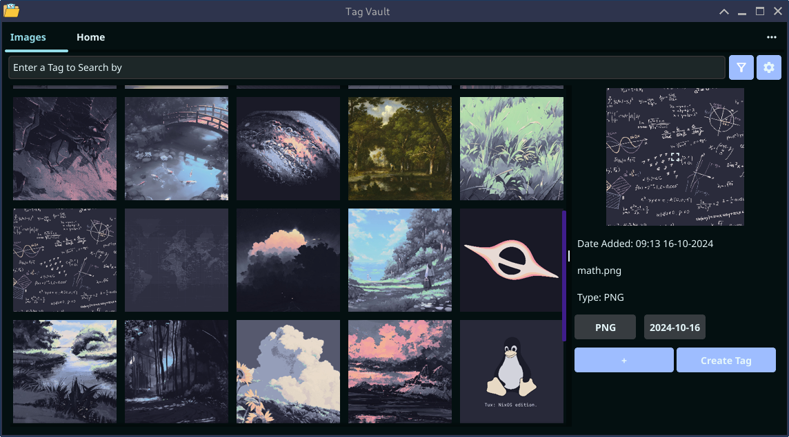

#  Tag Vault

## A simple file management app with tags

You can create tags, add them to images and search images by tags.
To make tags more stylish you can add colors to them.

To make this app possible I used Golang FyneGUI (not the best choice but it works for now) and SQLite3 for tag and options storage.

This apps current amazing features are:

- A Loading bar (much wow)
- Image loading/caching in the background
- Automatic image discovery
- Ability to add multiple tags to single image
- Ability to blacklist files and folders
- Moved files persist tags
- Search by tag date or name
- Meta tags [PNG, JPG, Date Added]
- On first launch checks the Users picture directory to not freeze the program

Coming soon:

- [x] Multi select
- [x] Archive
- [x] Compress
- [x] Encrypt
- [x] GIFs will GIF (GIFs now GIF)
- [x] Convert
- [ ] Sorting (Currently sorts by date added)

Current supported image types:

- [x] JPG/JPEG
- [x] PNG
- [x] BMP
- [x] GIF
- [x] HEIC
- [x] TIFF
- [x] WEBP
- [x] AVIF
- [x] QOI
- [x] SVG   Only Viewing
- [ ] RAW   No
- [ ] JPEGXL   Someday... Maybe... Possibly...?

## App Demo Images

### Default app state

### App with sidebar open

