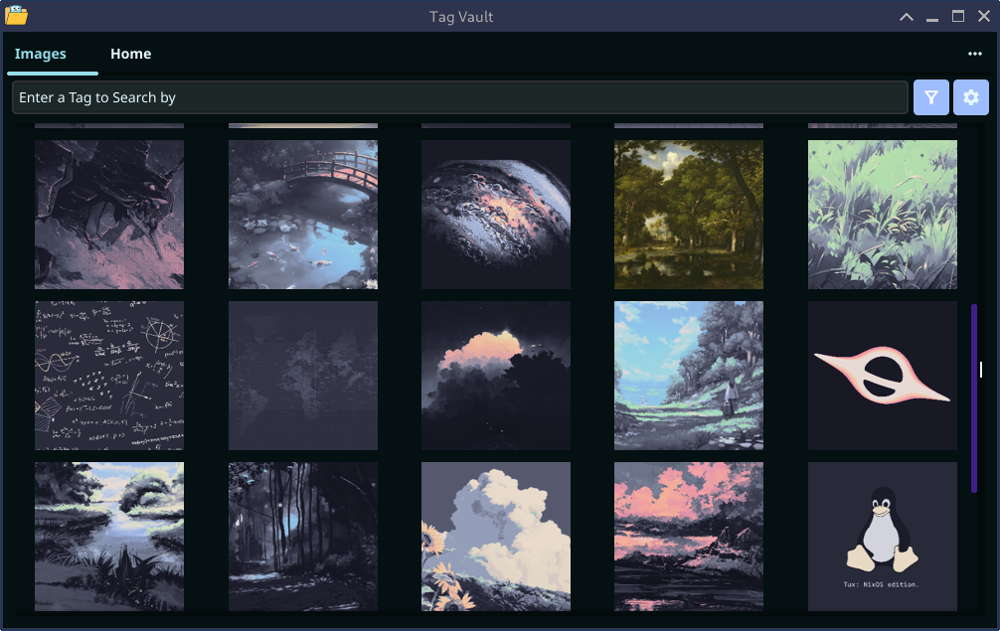

#  Tag Vault
## A simple file management app with tags.

You can create tags, add them to images and search images by tags.
To make tags more stylish you can add colors to them.

To make this app possible I used Golang FyneGUI (not the best choice but it works for now) and SQLite3 for tag and options storage.

This apps current amazing features are:
 - A Loading bar (much wow)
 - Image loading/caching in the background
 - Automatic image discovery
 - Ability to add multiple tags to single image
 - Ability to blacklist files and folders
 - Moved files persist tags
 - Search by tag date or name
 - Meta tags [PNG, JPG, Date Added]

Coming soon:
- [ ] Multi select
- [ ] Archive
- [ ] Compress
- [ ] Convert
- [ ] Sorting Currently sorts by date added

Current supported image types:
- [x] JPG/JPEG
- [x] PNG
- [ ] BMP
- [ ] GIF
- [ ] HEIC
- [ ] RAW
- [ ] TIFF
- [ ] WEBP
- [ ] SVG
- [ ] AVIF
- [ ] QOI
- [ ] JPEGXL

## App Demo Images:
### Default app state

### App with sidebar open

